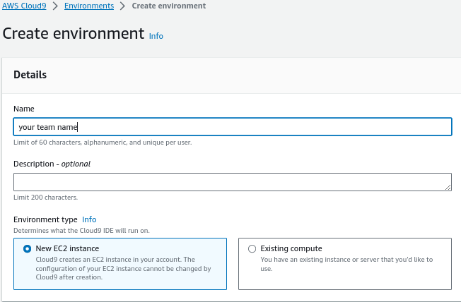
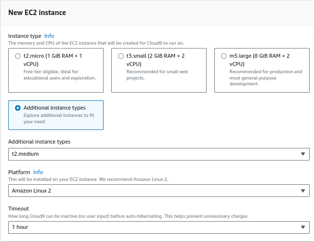
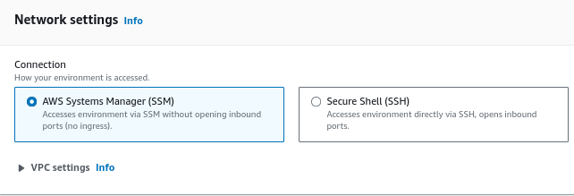
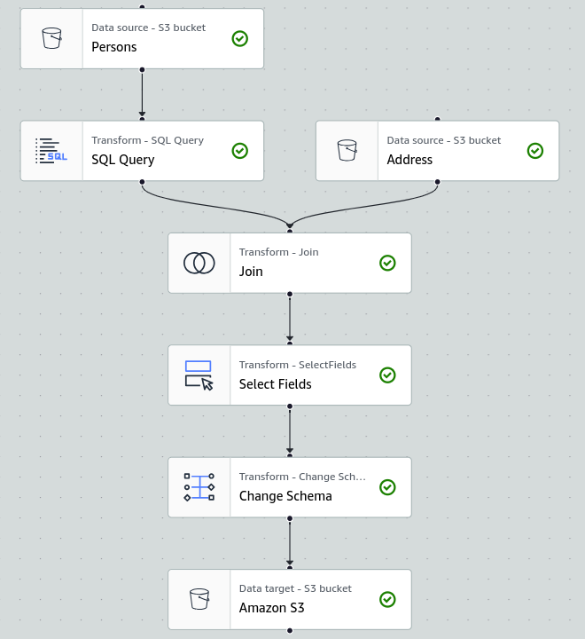

# Ippon Onboarding Cloud & DevOps

## Setup
You can either use your local machine or a Cloud9 environment to deploy the stacks.

### Local
Connect to the AWS account and create an access key in the IAM console.
Install [AWS CLI](https://docs.aws.amazon.com/cli/latest/userguide/getting-started-install.html ) and configure it with your credentials.
```bash
aws configure
```

### Cloud9
Create a Cloud9 environment in the eu-west-1 region, using the cloud9.yml template.
```bash
aws cloudformation create-stack --stack-name cloud9-$TEAMNAME --template-body file://cloud9.yml --parameters ParameterKey=TeamName,ParameterValue=$TEAMNAME --region eu-west-1
```
Or using the console :




Connect to the Cloud9 environment and clone this repository.
```bash
git clone https://github.com/gsuquet/ippon-tp-cloud.git
```

## Install the serverless framework and set your TeamName
```bash
npm install -g serverless
export TEAMNAME="<your-team-name>"
```

## 1/ Rekognition
### 1.1/ Deploy stack
```bash
cd 1-Rekognition
serverless deploy --stage $TEAMNAME
```

### 1.2/ Update the index.html file
In the 'index.html' file, replace the **API_GATEWAY_URL** variable with the generated API gateway url from the deployed stack.

### 1.3/ Upload the index.html file to your website bucket
```bash
aws s3 cp ./index.html s3://ippon-onboarding-rekognition-website-$TEAMNAME
```

### 1.4/ Verify your static web page and find the thief
Open the website url in your browser and upload an image to find the thief.
```bash
echo "https://ippon-onboarding-rekognition-website-$TEAMNAME.s3.$(aws s3api get-bucket-location --bucket ippon-onboarding-rekognition-website-$TEAMNAME --output text).amazonaws.com/index.html"
```

### 1.5/ Delete the content of the bucket
```bash
aws s3 rm s3://ippon-onboarding-rekognition-website-$TEAMNAME --recursive
```

### 1.6/ Delete the stack
```bash
serverless remove --stage $TEAMNAME
```

## 2/ Textract
### 2.1/ Deploy stack
```bash
cd ../2-Textract
serverless deploy --stage $TEAMNAME
```

### 2.2/ Copy the images to the S3 bucket
```bash
aws s3 cp ./data s3://workshop-textract-images-$TEAMNAME --recursive
```

### 2.3/ Sync the S3 bucket with the data folder to get the resulting CSV files
```bash
aws s3 sync s3://workshop-textract-images-$TEAMNAME ./data
```

### 2.4/ Concatenate the CSV files
```bash
mkdir ./data/suspects
cat ./data/*.csv > ./data/suspects/suspects.csv
sed -i '/^$/d' ./data/suspects/suspects.csv
```

### 2.5/ Upload the CSV file to the S3 bucket
```bash
aws s3 sync ./data s3://workshop-textract-images-$TEAMNAME
```

## 3/ Glue
### 3.1/ Upload the CSV file to the S3 bucket
```bash
cd ../3-Glue
aws s3 cp ./data s3://workshop-textract-images-$TEAMNAME/address --recursive
```

### 3.2/ Create an IAM role for Glue
```bash
aws iam create-policy --policy-name GlueOnboardingPolicy-$TEAMNAME --policy-document file://glue-policy.json  --output text
aws iam create-role --role-name GlueOnboardingRole-$TEAMNAME --assume-role-policy-document file://glue-role.json
aws iam attach-role-policy --role-name GlueOnboardingRole-$TEAMNAME --policy-arn $(aws iam list-policies --region eu-west-1 --query "Policies[?PolicyName=='GlueOnboardingPolicy-$TEAMNAME'].Arn" --output text)
```

### 3.3/ Create the Glue job


Import the csv files from the S3 bucket.
- Data Format : CSV
- Delimiter : Comma (,)
- Quote character : Double quote (")
- First line of file contains colun headers : True
- Infer schema : True

Transform the data using an SQL query.
```sql
select
cast(unbase64(trim(prenom)) as string) as prenom, cast(unhex(trim(nom)) as string) as nom, trim(telephone) as telephone, trim(id_adresse) as id_adresse
from myDataSource
```

Join the two tables using the id_adresse column.
id_adresse = id(inner join)

Export the results to the S3 bucket.
- Format : CSV
- S3 Target Location : s3://workshop-textract-images-$TEAMNAME/results/
- Create a table in the Data Catalog and on subsequent runs, update the schema and add new partitions : True
- Database : debault
- Table name : "TEAMNAME"

Set the IAM role to the GlueServiceRole-$TEAMNAME role.


### 3.4/ Query the results in Athena
Search for Roza Otunbayeva in the results.
Athena query : 
```sql
SELECT * FROM "default"."$TEAMNAME" WHERE "prenom" = 'Roza'
```
or using the cli :
```bash
aws athena start-query-execution --region=eu-west-1 --query-string "SELECT * FROM \"default\".\"$TEAMNAME\" WHERE \"prenom\" = 'Roza'" --result-configuration OutputLocation=s3://workshop-textract-images-$TEAMNAME/query-results/
```


## 4/ Clean up
```bash
aws s3 rm s3://workshop-textract-images-$TEAMNAME/ --recursive
cd ../2-Textract
serverless remove --stage $TEAMNAME
aws iam detach-role-policy --role-name GlueOnboardingRole-$TEAMNAME --policy-arn $(aws iam list-policies --region eu-west-1 --query "Policies[?PolicyName=='GlueOnboardingPolicy-$TEAMNAME'].Arn" --output text)
aws iam delete-role --role-name GlueOnboardingRole-$TEAMNAME
aws iam delete-policy --policy-arn $(aws iam list-policies --region eu-west-1 --query "Policies[?PolicyName=='GlueOnboardingPolicy-$TEAMNAME'].Arn" --output text)
```
